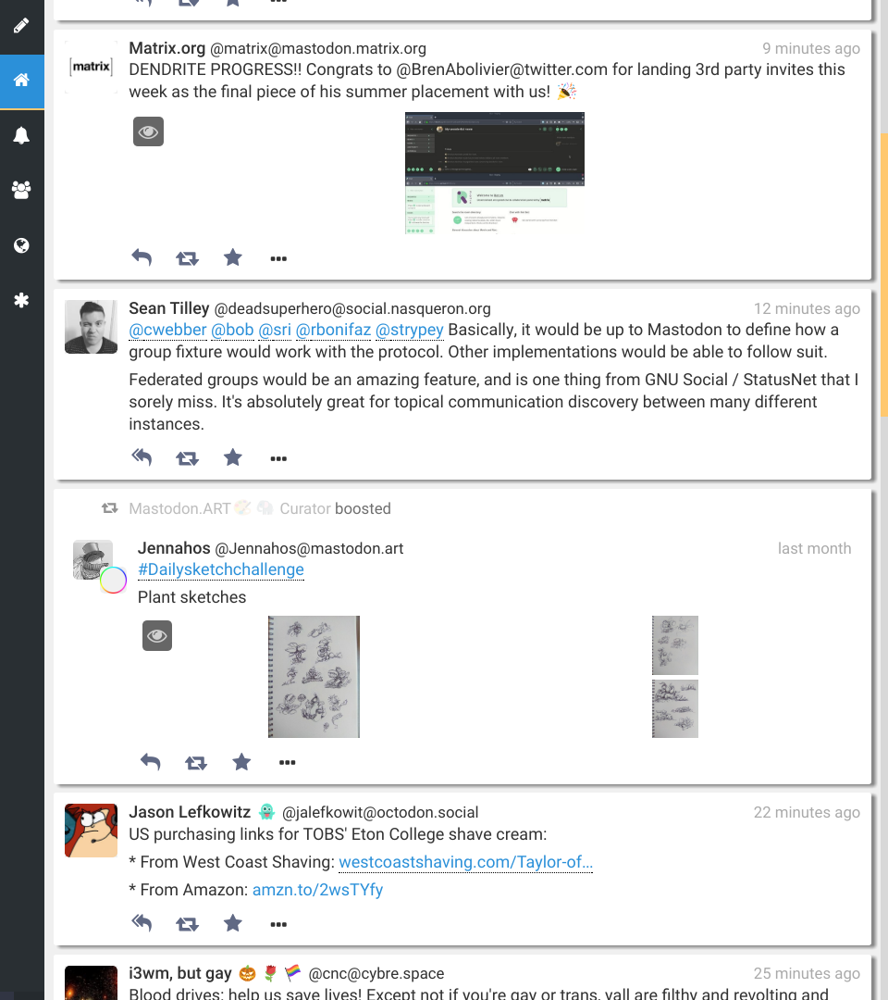

Mastodon Material Tweaks
========================

Collected herein is an [userstyle][u:mmt] built upon the [Mastodon
Material][u:mm] theme, for the [Mastodon][m] social network. While the stock
material theme is phenomenal as it is, I had a few things I wanted to tweak, and
this additional userstyle was born.

 [u:mmt]: https://userstyles.org/styles/148115/mastodon-material-tweaks
 [u:mm]: https://userstyles.org/styles/147450/mastodon-material
 [m]: https://joinmastodon.org/

 

As is obvious from the screenshot, the theme is optimized for the case where
Mastodon displays a single column at a time. A window taking up half of an
1920x1080 screen is the perfect size.

Changes include:

- Links within status cards are colored blue, and underlined on hover.
- The top bar was moved to the left, and was turned dark. It now slides out when
  hovered.
- Boosted and favourited toots had their "boosted by"/"favourited by" messages
  moved within the status card.
- The notification tab had a major overhaul:
  - Favourited toots are highlighted with a faint yellow background.
  - Boosted toots are highlighted with a faint green background.
  - New followers are not boxed, but appear plainly on the background.
- Media galleries have a white background, for a more seamless experience.
- Several margins and paddings have been removed or adjusted, for better use of
  the screen.
- Several widgets were removed or hidden, because their role is fulfilled by
  something else:
  - The navigation header above the compose widget in full-size mode has been
    hidden, because the navigation sidebar is always visible now.
  - The column headers (`Home`, `Notifications`, etc) are hidden by default,
    they appear when hovering over the very top of the page.
- The scrollbar had its track hidden, and its color lightened.
- Most of the icon buttons rotate when hovered over.
- Dropdown menus were changed to have a white background, and lighter shadows.
- The compose widget (and page) was restyled to be card-based too.
- Various minor fixes here and there.
